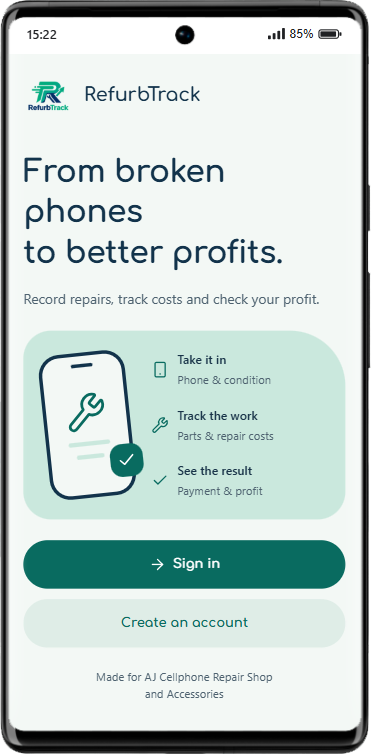
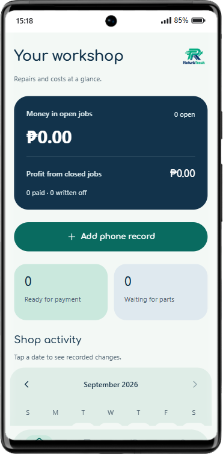
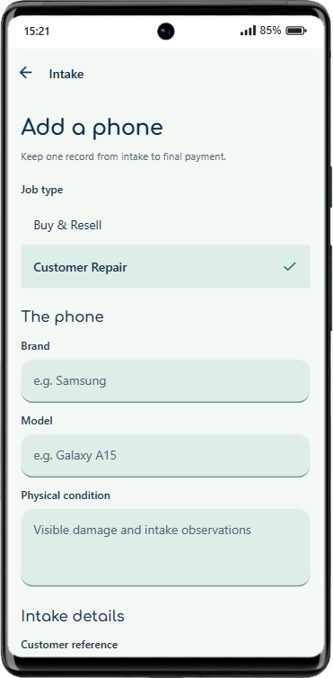
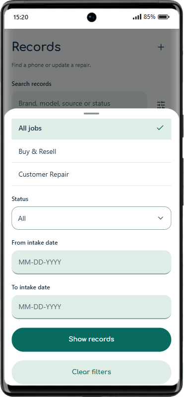

<p align="center">
  
</p>

<h1 align="center">RefurbTrack</h1>

<p align="center">Repair costs and profit, tracked per phone.</p>

An Android app for AJ Cellphone Repair Shop and Accessories in Tagum City. Track phones bought for resale and devices brought in for repair.

## Get the Android app

[Download Android APK](https://expo.dev/artifacts/eas/XkHFCGStGwM9RVbadX90zHpzn0YztxCiSWaGQ8iEkUM.apk) · [Expo build details](https://expo.dev/accounts/wrnzn/projects/RefurbTrack/builds/ff2e2b74-a4cd-4009-aa3f-b9811916ea63)

Version 1.1.1 · Build 4 · September 27, 2026

The source includes a newer fix that keeps the filter panel open when choosing a status. Rebuild the APK to include this fix.

## Screenshots

<p align="center">
  
  
  
  
</p>

## Features

- Record each phone's condition, diagnosis, repair estimate, parts, and labor costs.
- Track job status, payments, write-offs, and profit or loss.
- Search records and filter by job type, status, or intake date.
- View money tied up in open jobs, completed sales, and daily shop activity.
- Sign in to save and reopen your phone records.
- Save shop reports as PDFs.
- Switch between light and dark mode.
- Copy or share technical details when an error occurs.

## Financial rules

Total investment = purchase price + parts expenses + paid labor expenses.

Profit or loss = final revenue − total investment.

Only closed jobs count toward realized profit. Writing off a phone counts its accumulated costs as a loss. Customer repairs have no purchase cost; phones acquired for free can still be resale jobs.

Amounts are stored in whole centavos. These totals exclude rent, tax, and other overhead.

## Built with

React Native 0.86, Expo SDK 57, and React 19. Firebase Authentication handles sign-in; Cloud Firestore stores shop records. See [design sources](docs/design-sources.md) for UI references and credits.

Version 1.1.1 fixes PDF export on Android and adds shareable error details. The release passed 33 automated tests and Android/web JavaScript exports. Testing on a physical Android device is still pending.

## Run locally

Requires Node.js 22.13 or newer.

```powershell
npm ci
npm test
npx expo start
```

Sign-in requires Firebase configuration. Follow [setup and packaging](docs/SETUP.md) to connect Firebase or build an Android APK.

## Authors

Built for CCE 106/L Application Development and Emerging Technologies at UM Tagum College.

Joseph D. Alejo, Ynoid Dan M. Blagantio, Ace Jerald C. Galvez, and Novecille Lapasaran.

Instructor: Maricel Timbal.
